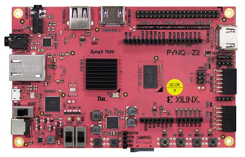
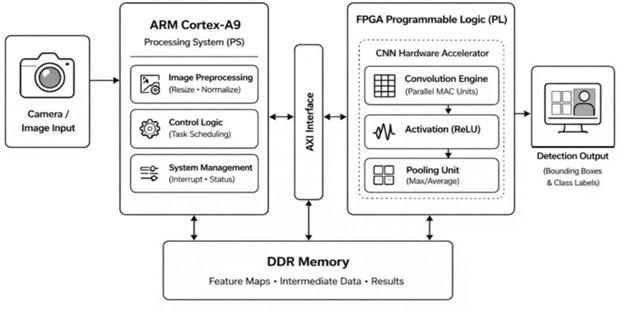
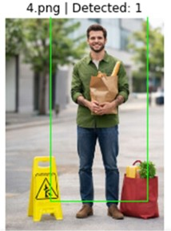
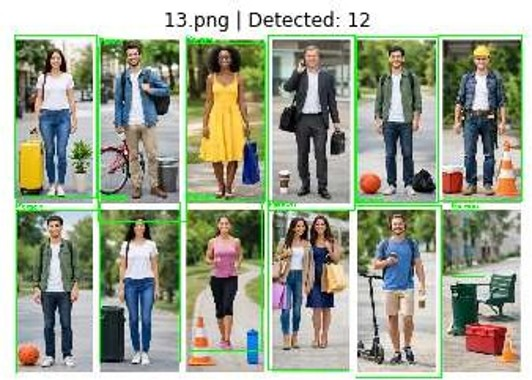
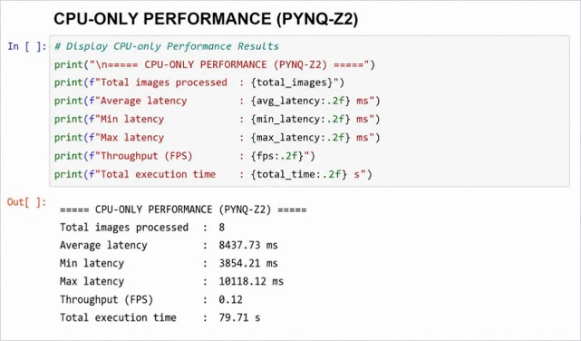
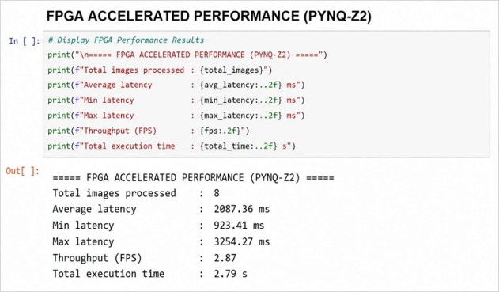

# 🚀 Real-Time Object Detection on PYNQ-Z2

> Design and implementation of a real-time embedded vision system on the Xilinx PYNQ-Z2 platform using OpenCV, Python, and hardware-software co-design concepts.



---

## 📖 Overview

Real-Time Object Detection on PYNQ-Z2 is an embedded vision project that demonstrates human detection using computer vision techniques on a Xilinx Zynq-based platform. The system processes images, detects human subjects in real-time, and evaluates system performance through latency and throughput analysis.

This project showcases the integration of embedded computing, computer vision, and performance evaluation on FPGA-enabled hardware platforms for edge intelligence applications.

---

## 🎯 Objectives

* Develop a real-time object detection system on the PYNQ-Z2 platform.
* Implement image processing and object detection using OpenCV.
* Evaluate system performance using latency and throughput metrics.
* Demonstrate embedded vision concepts for edge computing applications.
* Explore hardware-software co-design methodologies on Zynq SoC platforms.

---

## 🖥️ Hardware Platform

### Xilinx PYNQ-Z2

The project is implemented on the Xilinx PYNQ-Z2 development board based on the Zynq-7000 SoC architecture.

**Key Features:**

* Dual-core ARM Cortex-A9 Processor
* FPGA Programmable Logic (PL)
* DDR3 Memory
* HDMI Support
* USB Connectivity
* Embedded Linux Support
* Python Productivity Environment

---

## 🏗️ System Architecture



### System Workflow

1. Input image acquisition
2. Image preprocessing and resizing
3. Feature extraction using OpenCV
4. Human detection processing
5. Non-Maximum Suppression (NMS)
6. Bounding box generation
7. Detection result visualization
8. Performance evaluation

---

## ⚙️ Software Stack

| Component               | Technology       |
| ----------------------- | ---------------- |
| Programming Language    | Python           |
| Computer Vision         | OpenCV           |
| Numerical Computing     | NumPy            |
| Visualization           | Matplotlib       |
| Development Environment | Jupyter Notebook |
| Embedded Platform       | PYNQ-Z2          |
| Hardware Platform       | Xilinx Zynq-7000 |

---

## 🔍 Detection Methodology

The system utilizes Histogram of Oriented Gradients (HOG) feature extraction combined with a Support Vector Machine (SVM) classifier for human detection.

### Processing Pipeline

```text
Input Image
     ↓
Image Resizing
     ↓
HOG Feature Extraction
     ↓
SVM Classification
     ↓
Non-Maximum Suppression
     ↓
Detection Output
```

This approach enables efficient and reliable human detection while maintaining compatibility with resource-constrained embedded platforms.

---

## 🎯 Detection Results

### Single Person Detection



The system successfully detects an individual human subject and generates an accurate bounding box around the detected person.

### Multiple Person Detection



The system successfully identifies multiple individuals within the scene and produces bounding boxes for each detected subject.

---

## 📊 Performance Analysis

### CPU Performance



### FPGA Performance



### Comparative Performance Evaluation

| Metric               | CPU Execution | FPGA Execution |
| -------------------- | ------------- | -------------- |
| Images Processed     | 8             | 8              |
| Average Latency      | 8437.73 ms    | 2087.36 ms     |
| Throughput           | 0.12 FPS      | 2.87 FPS       |
| Total Execution Time | 79.71 s       | 2.79 s         |

### Key Observations

* Significant reduction in processing latency.
* Improved throughput performance.
* Faster execution compared to software-only implementation.
* Demonstrates the benefits of hardware-assisted embedded vision processing.
* Suitable for edge computing and intelligent vision applications.

---

## 📂 Repository Structure

```text
Real-Time-Object-Detection-on-PYNQ-Z2
│
├── docs/
│   ├── Project_Report.pdf
│   └── Presentation.pptx
│
├── images/
│   ├── Architecture.png
│   ├── Board_Image.png
│   ├── CPU_Output.jpg
│   ├── FPGA_Output.jpg
│   ├── Output_Multiple_Person.png
│   └── Output_Single_Person.png
│
├── src/
│   └── person_detection.py
│
├── results/
│
├── README.md
├── LICENSE
└── .gitignore
```

---

## 🚀 Future Enhancements

* Real-time webcam integration
* CNN-based object detection models
* YOLO implementation
* MobileNet deployment
* FPGA accelerator optimization
* Live video analytics
* Edge AI integration

---

## 📚 Documentation

Detailed project documentation is available in the `docs` directory:

* Project Report
* Project Presentation
* Architecture Details
* Experimental Results

---

## 👨‍💻 Author

### INIYAVAN S

**B.E. Electronics Engineering (VLSI Design & Technology)**

Areas of Interest:

* FPGA Design
* Embedded Systems
* VLSI Design
* Verification Engineer
* Hardware-Software Co-Design

---

## 📜 License

This project is licensed under the MIT License.
